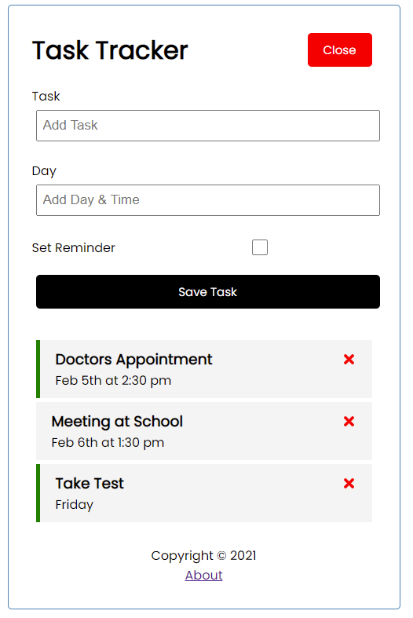

# React Task Tracker App

Simple task tracker application created by following along from: [React JS Crash Course 2021](https://www.youtube.com/watch?v=w7ejDZ8SWv8)

Full React UI with json-server for mock backend.

Run development server: `npm start` \
Start json server backend: `npm run server`

Build for production: `npm run build` \
Serve production: `serve -s build -p 8000`

---

